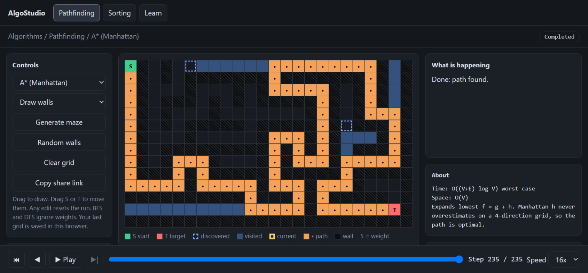
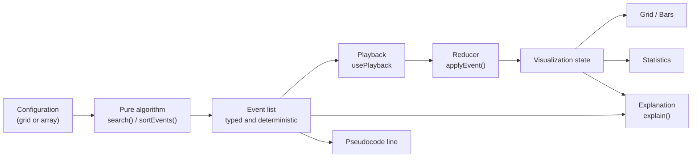
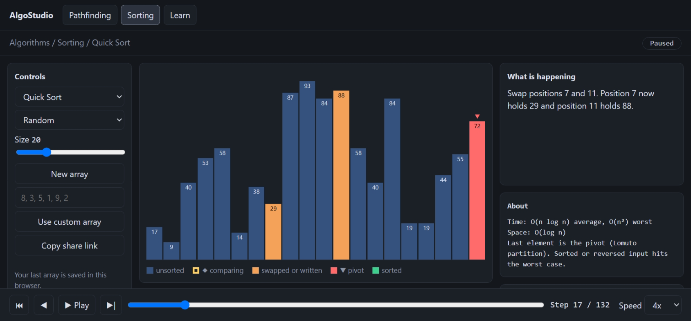
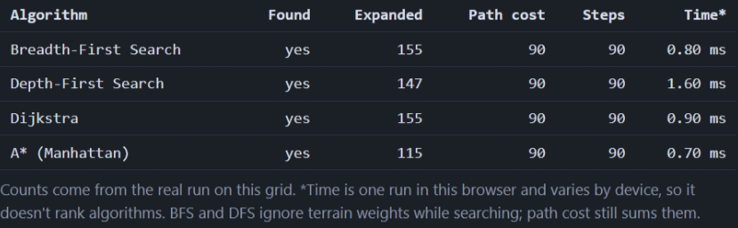
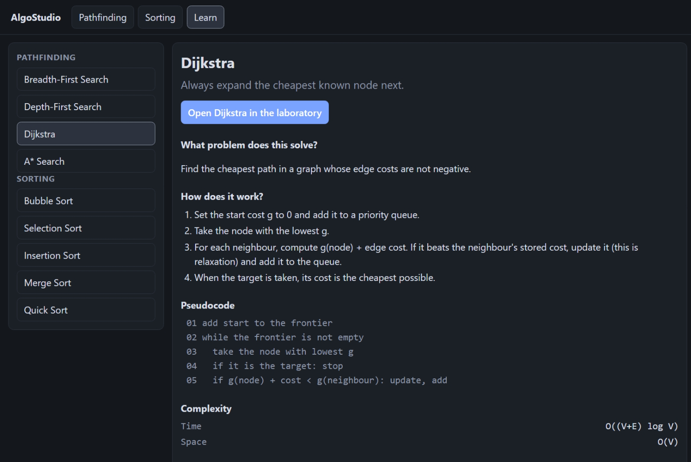

# AlgoStudio

**An interactive algorithm laboratory built around a deterministic, event-driven execution engine.**
Algorithms emit structured execution events. A playback layer replays them, and the visualization,
pseudocode highlighting, plain-language explanations and statistics are all derived from those events.

**Live demo:** https://buravetran.github.io/algostudio/

> Don't just show the result. Show the reasoning.



## Problem statement

Most algorithm visualizers animate a result: bars move, cells change color. They rarely explain *why*
the algorithm did something, and the animation is often tangled with the algorithm code, which makes it
hard to verify that the algorithm is actually correct.

AlgoStudio separates the two. The algorithm is a pure function that is tested on its own. Its execution
is a list of typed events. Everything the user sees is a view of those events.

## Features

**Pathfinding laboratory**
- BFS, DFS, Dijkstra and A* (Manhattan heuristic) on an editable grid
- Walls, weighted terrain (cost 5), random walls, and a seeded maze generator that is always solvable
- Step forward and back, play, pause, scrub the timeline, change speed
- Plain-language explanations such as *"It was 14 before. 11 < 14, so the cost is updated."*, with `g`, `h` and `f` shown for A*
- Pseudocode with the current line highlighted
- **Predict mode:** guess which node is taken next, graded from the event list
- Compare all four algorithms on the same grid

**Sorting laboratory**
- Bubble, Selection, Insertion, Merge and Quick sort
- Presets (random, nearly sorted, reversed, few unique, many duplicates) and a validated custom-array input
- Comparisons, swaps, writes, pivot and sorted positions are shown separately
- **Challenge mode:** questions about the next comparison, swap, write or pivot
- Compare all five algorithms on the same array

**Learn**
- A lesson for each of the nine algorithms: intuition, steps, pseudocode, complexity, common mistakes,
  and self-test questions, with a button that opens the laboratory with that algorithm selected

**Across the app**
- Share links (`#x=` for pathfinding, `#s=` for sorting) and local autosave. Only the configuration is
  stored, never animation frames, so a link reproduces the exact run
- Keyboard controls (space, left and right arrows), reduced-motion support, shapes and symbols in
  addition to color, and screen-reader announcements when a run completes
- Light and dark themes that follow the system setting

## Architecture



The layers are kept strictly separate:

| Layer | Responsibility | Knows about the UI? |
| --- | --- | --- |
| Algorithm | Computation | No |
| Events | Describe what the algorithm did | No |
| Playback | Controls time (position, speed) | No |
| Reducer | Turns events into visualization state | No |
| Rendering | Draws the state | Yes |
| Education | Turns events and state into explanations | No |

More detail, including design decisions and known limitations, is in [docs/ARCHITECTURE.md](docs/ARCHITECTURE.md).

## Technology

React 18, TypeScript (strict), Vite, Vitest, plain CSS with design tokens. There is no backend: all
computation runs in the browser, and the app is deployed as static files with GitHub Pages.

## Run it locally

```bash
npm install
npm test          # unit and property-style tests
npm run dev       # http://localhost:5173
npm run build     # type-check and production build into dist/
```

## Project structure

```text
src/
├── App.tsx, main.tsx, styles.css
├── components/PlaybackBar.tsx        shared playback controls
├── lib/                              usePlayback, seeded RNG, URL hash helper
└── features/
    ├── pathfinding/
    │   ├── algorithms/               heap.ts (priority queue), search.ts (BFS, DFS, Dijkstra, A*)
    │   ├── engine/                   reducer.ts, explain.ts
    │   ├── components/               Grid, Workspace, ComparePanel
    │   └── grid.ts, maze.ts, share.ts, content.ts, types.ts
    ├── sorting/
    │   ├── algorithms/sort.ts        five sorting algorithms that emit events
    │   ├── engine/                   reducer.ts, explain.ts
    │   ├── components/               Bars, SortWorkspace, SortComparePanel
    │   └── arrays.ts, challenge.ts, share.ts, content.ts, types.ts
    └── learning/                     lessons.ts, LearnPage.tsx
```

## Events

Pathfinding: `PUSH`, `RELAX`, `POP`, `REACH`, `PATH`, `DONE`.
Sorting: `CMP`, `SWAP`, `SET`, `PIVOT`, `OK`, `END`.

Each event is a plain object. For example, relaxing an edge in Dijkstra:

```json
{ "type": "RELAX", "node": 41, "from": 40, "old": 14, "g": 11, "f": 11 }
```

## Testing

Visualizations can hide a wrong algorithm behind a convincing animation, so correctness is tested
without the UI:

- **Priority queue:** empty queue, ordering, equal priorities (first in, first out), interleaved push and pop, and 500 pseudo-random values compared with a sorted copy
- **Pathfinding:** returned paths start at the start and end at the target, every step is between neighbours, the reported cost equals the sum of terrain costs, unreachable targets return no path, BFS finds the fewest steps, Dijkstra and A* avoid costly terrain, and A* matches Dijkstra's cost on 200 seeded random grids
- **Sorting:** for every algorithm, replaying the events on a copy of the input gives a sorted permutation of it (empty, single, duplicate, reversed and random arrays), each position is marked final exactly once, the input is not modified, and exact comparison and swap counts match known values
- **Maze generator:** start and target are always connected, and the same seed gives the same maze
- **Share links, array input and challenge questions:** round trips, and rejection of malformed input
- **Lessons:** every algorithm has exactly one complete lesson

Deterministic seeds are used so failures are reproducible. CI runs type-checking, the tests and the
build on every push.

## Performance notes

- Algorithms run once per configuration, not once per animation frame. Playback only moves a position through the event list
- Stepping forward applies one event. Stepping back replays from the start, which is fast at these sizes; periodic snapshots are the planned upgrade for long runs
- Side panels have fixed heights so changing explanation text cannot resize the page during playback
- Browser run time is shown for reference only and is labeled as machine-dependent. The comparison tables rank algorithms by counted operations, not by milliseconds

## Screenshots

| Pathfinding | Sorting |
| --- | --- |
|  |  |

| Compare | Learn |
| --- | --- |
|  |  |

## Deployment

Pushing to `main` runs the GitHub Actions workflow in `.github/workflows/deploy.yml`: install,
type-check, test, build, then deploy `dist/` to GitHub Pages. In the repository settings, Pages must be
set to the **GitHub Actions** source. The build uses relative asset paths, so it works under a
repository subpath.

## Known limitations

- Merge sort highlights the positions being merged, not the exact values
- Insertion sort is drawn as repeated adjacent swaps, not as shifts
- Bubble sort has no early exit, so it always does n(n - 1) / 2 comparisons
- Only 4-direction movement and the Manhattan heuristic are supported
- Stepping backward replays from the start

## Future improvements

- Snapshot-based rewind for long runs
- More heuristics and movement models (Chebyshev, Euclidean, diagonal moves) tied to their admissibility
- Greedy best-first, bidirectional search, Bellman-Ford
- Graph editor and graph traversal on arbitrary graphs
- Playwright end-to-end tests
- Optional backend for accounts and saved experiments (Laravel, Sanctum)

## License

MIT. See [LICENSE](LICENSE).
