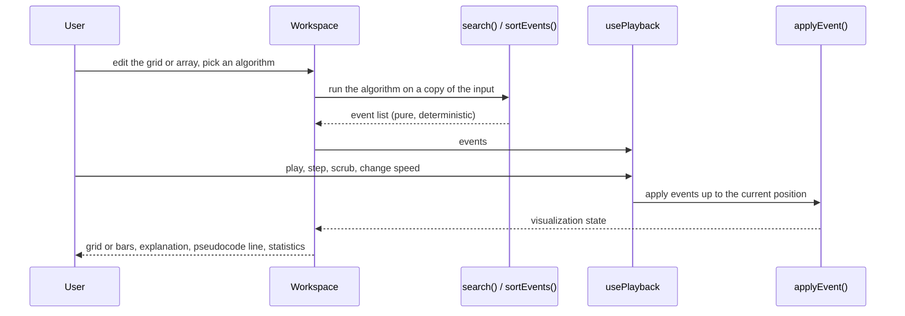
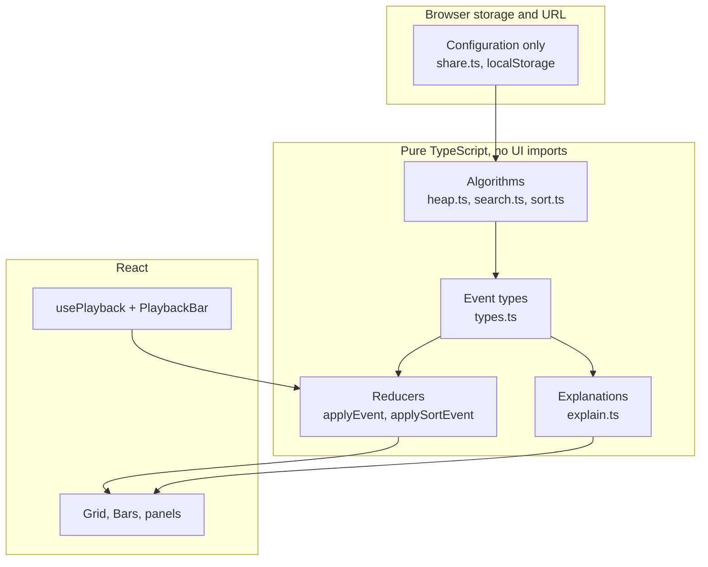

# Architecture

## The pipeline

## Layers

## Design decisions

**Algorithms run in the browser.** The input is small and a run takes a fraction of a second, so there
is nothing to gain from a server. It also means the app works offline once loaded and deploys as static
files.

**Event-driven execution.** The algorithm does not draw anything and has no timers. It returns a list of
events, and playback moves a position through that list. That gives pause, step, scrub, replay and speed
changes for free, keeps runs deterministic, and makes the algorithm testable without a browser.

**Playback is separate from algorithms.** Speed only changes how fast the position advances. It cannot
change what an algorithm does.

**Determinism.** Ties in the priority queue break by insertion order, the maze generator and tests use
seeded random numbers, and the algorithms contain no hidden randomness, so the same configuration always
produces the same event list.

**One loop for four pathfinding algorithms.** BFS, DFS, Dijkstra and A* differ only in the frontier
(queue, stack, or priority queue keyed by `g` or `g + h`), so `search()` is one function. Movement rules
live in `neighbors()`, not in the algorithms, so graphs other than grids can be added later.

**Explanations come from structured events.** An event says *what* happened. `explain()` turns that and
the current state into words. Text is never hard-coded inside the animation.

**Saved experiments store configuration, not frames.** A share link holds the grid or array and the
algorithm. Opening it replays the run, which keeps links short and reproducible.

**Browser run time is not a benchmark.** It depends on the device, browser and load. The comparison tables
use counted operations and show run time only as a labeled, single-run reference.

**State is split by ownership.** Experiment configuration (grid or array, algorithm), execution state
(events, position, speed) and view state (tool, challenge mode) live in different places rather than in one
global object.

## Adding an algorithm

1. Add its id to the type in `types.ts`.
2. Implement it as a pure function that returns events (or add a case to `search()` / `sortEvents()`).
3. Add its name, complexity, pseudocode and lesson to `content.ts` and `lessons.ts`.
4. Add tests: replay or path validity, plus any known counts.

The playback, reducer, explanation, statistics, comparison table and lesson page work without changes
when the event types already cover the new algorithm.

## Known limitations

See the README. The main ones are that stepping backward replays from the start (snapshots are planned)
and that two sorting visualizations (merge highlights and insertion moves) are simplified.
